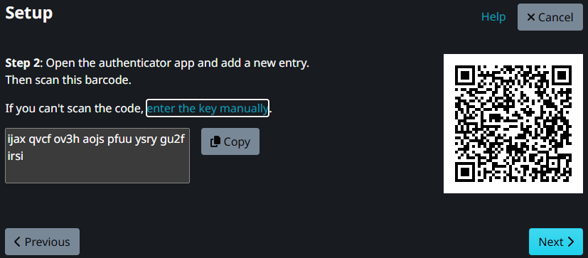

# 🥬 YasaiRap Backend

**YasaiRap Backend** は、VRChat 上で開催される大会・イベントを Discord から自動管理するためのバックエンドシステムである。  
Discord Bot を介して出場登録、試合結果の記録、ホワイトリスト生成を行い、VRChat ワールドにデータを連携する。

---

## ⚙️ 技術スタック

| 項目 | 使用技術 |
|------|-----------|
| 言語 | Go 1.25.1 |
| Web Framework | Echo v4 |
| DB | MySQL 8.4 |
| Migration | Atlas |
| Container | Docker / docker-compose |
| Discord連携 | [discordgo](https://github.com/bwmarrin/discordgo) |


## 🐳 Dockerセットアップ

### 1. リポジトリ取得
```bash
git clone https://github.com/htomoya16/YasaiRap_backend.git
cd YasaiRap_backend
```

### 2. 環境変数の設定

`.env.example`より`.env` ファイルを作成し、以下を設定する。
Discord関連、VRCHAT API用については後述。

```env
# MySQL
MYSQL_ROOT_PASSWORD=changeme
MYSQL_DATABASE=yasairap
MYSQL_USER=yasairap_user
MYSQL_PASSWORD=changeme
MYSQL_PORT=3306
MYSQL_TZ=UTC

# アプリ
APP_PORT=8080
DB_HOST=mysql
DB_PORT=3306

# DISCORD関連
DISCORD_TOKEN=
DISCORD_APP_ID=
DISCORD_GUILD_ID=

# VRCHAT API用
YASAIRAP_CONTACT_EMAIL=your-contact-email-for-vrchat-api
VRCHAT_USERNAME=your-vrchat-username
VRCHAT_PASSWORD=your-vrchat-password
# 空白は埋める
VRCHAT_TOTP_SECRET=your-vrchat-totp-secret-key(BASE32)
```

### 3. プロジェクトを起動(開発環境)
#### 初回
```bash
# Dockerコンテナを起動
docker compose up --build

# バックグラウンドで起動する場合
docker compose up -d --build
```

#### 初回以降
```bash
# Dockerコンテナを起動
docker compose --profile dev up

# バックグラウンドで起動する場合
docker compose --profile dev up -d
```

#### 止め方
```bash
docker compose --profile dev down
```

### 4. プロジェクトを起動(本番環境)
#### 初回
```bash
# Dockerコンテナを起動
docker compose --profile prod up --build

# バックグラウンドで起動する場合
docker compose --profile prod up -d --build
```

#### 初回以降
```bash
# Dockerコンテナを起動
docker compose --profile prod up

# バックグラウンドで起動する場合
docker compose --profile prod up -d
```

#### 止め方
```bash
docker compose --profile prod down
```

### 5. Atlas によるマイグレーション適用
#### Atlas のインストール（WSL 上で実行）
```bash
curl -sSf https://atlasgo.sh | sh
```

####　マイグレーション適用(4. でdocker compose upした状態)
```bash
atlas migrate apply --env local
```

## 🤖 Discord Bot セットアップ

このバックエンドは Discord Bot を通じて操作される。  
以下の手順で Discord Developer Portal 上に Bot を作成し、環境変数に必要な値を設定する。

### 1. アプリケーションの作成

1. [Discord Developer Portal](https://discord.com/developers/applications) にアクセスし、ログインする。  
2. 「**New Application**」をクリックして新しいアプリケーションを作成。  
   名前は例として `YasaiRap Bot` にしておくと分かりやすい。  
3. 作成後、左メニューから **Bot** を選び、「Add Bot」→「Yes, do it!」をクリック。  
4. 作成された Bot のトークンをコピーして `.env` に設定する(Dockerセットアップ2.)。
```env
DISCORD_TOKEN=xxxxxxxxxxxxxxxxxxxxxxxxxxxxxxxxxxxxxxxxxxxxxxxxxxxxxxxxxxxx
```

### 2. Application ID と Guild ID の取得

#### (1) Application ID

1. Developer Portal のアプリケーションページで`YasaiRap Bot`を選択し **General Information** を開く。  
2. 「Application ID」をコピーして `.env` の `DISCORD_APP_ID` に設定する。

#### (2) Guild ID（サーバID）

1. Discord クライアントの「設定 → 詳細設定」から **開発者モード** を有効にする。  
2. Bot をテストする Discord サーバで、サーバアイコンを右クリック → 「IDをコピー」。  
3. `.env` の `DISCORD_GUILD_ID` に貼り付ける。

### 3. Bot をサーバに招待

1. Developer Portal の **OAuth2 → URL Generator** を開く。  
2. 「**bot**」と「**applications.commands**」にチェックを入れる。  
3. 「Bot Permissions」で以下を選択：
   - Send Messages  
   - Read Message History
   - View Channels  
   - Manage Messages  
   - Use Slash Commands  
4. 生成された URL をブラウザで開き、テスト用サーバに Bot を追加する。

### 4. Intent の設定

Bot がメッセージ内容やメンバー情報にアクセスできるようにするため、  
**Bot → Privileged Gateway Intents** で以下を有効化しておく。

- ✅ **MESSAGE CONTENT INTENT**  
- ✅ **SERVER MEMBERS INTENT**

### 5. VRCHAT API用の.envについて
#### 👤 運営専用 VRChat アカウントの作成
YasaiRap Backend が VRChat API にアクセスする際には、**自動ログイン（ユーザ名・パスワード・TOTP認証）** を行う。  
そのため、個人アカウントを使用すると以下のリスクが発生する：

- パスワードやTOTPシークレットが漏洩した場合に**個人アカウントが乗っ取られる**  
- 頻繁なAPIアクセスにより、**通常プレイ用アカウントが一時的に制限**される可能性  


このため、**運営専用のVRChatアカウントを新規に作成**することを強く推奨する。

1. **VRChat公式サイトにアクセス**
   [https://vrchat.com/home](https://vrchat.com/home) にアクセスし、右上の「Sign Up」から新規登録を行う。

2. **運営専用の情報で登録**
   - ユーザ名：`yasairap_admin` や `event_manager_vrc` など、運営が識別しやすい名前  
   - メールアドレス：運営チームで共有可能なメール(これも新しく作成することを推奨)（例：`admin@yourdomain.com`）  
   - パスワード：他サービスと共有しない強力なものを設定

3. **ログインして 2FA を有効化**
   - Account Settings ページから Two-Factor Authentication (2FA) を有効にする  
   
   - Next を押し、enter the key manually をクリックしてでてくる32桁の英数字を確認する。
   
   通常、以下のような形式で表示されている：```
   abcd efgh ijkl mnop qrst uvwx yz12 3456 ```
   - **空白を削除して1行にまとめ`.env` に設定**  


4. **.env に登録**
   `.env` ファイルに以下を設定する：

   ```bash
   # VRCHAT API用
   YASAIRAP_CONTACT_EMAIL=your-contact-email-for-vrchat-api
   # 運営専用のVRChatアカウントのusername, password
   VRCHAT_USERNAME=your-vrchat-username
   VRCHAT_PASSWORD=your-vrchat-password
   # 空白は埋める
   VRCHAT_TOTP_SECRET=your-vrchat-totp-secret-key(BASE32)
   ```

### 6. 動作確認

環境変数が設定された状態でアプリを起動(Dockerセットアップ 3.で```docker compose up --build```する)後、Discord サーバで Bot がオンラインになれば成功。
